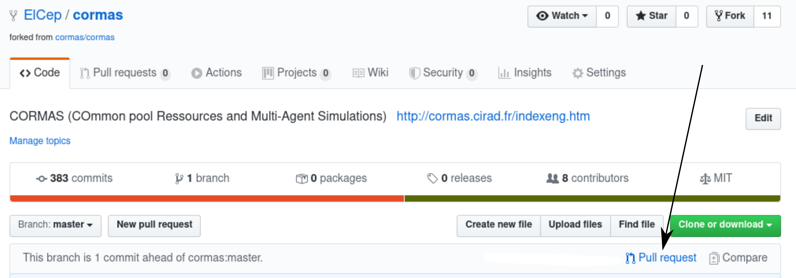
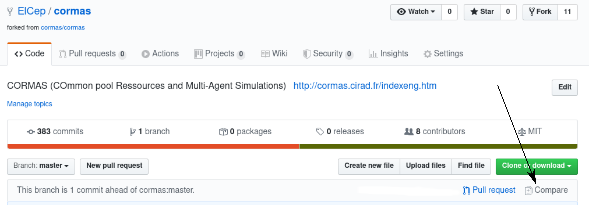

# Contribution Guide for CORMAS

*This file is currently not complete but will be improve step by step.*

You need to download Pharo 8.0 first.

## Setup Iceberg
You need an ssh key in order to commit on github. Open Iceberg tool, and then click on the settings. Check the box : "Use custom SSH keys".

## Fork the Cormas repository

All changes you'll do will be versionned in your own fork of the [CORMAS repository](https://github.com/cormas/cormas). Then, from your fork you'll be able to issue pull requests to Cormas, where they will be reviewed, and luckily, integrated.

Go to Cormas github's repository and click on the fork button on the top right. Yes, this means that you'll need a github account to contribute to Cormas.

## Load your fork version of Cormas in your image:
In your Pharo 8.0 image, load now the last development version of Cormas :

```Smalltalk
Metacello new
        onWarningLog;
        githubUser: 'XXX' project: 'cormas' commitish: 'master' path: 'repository';
        baseline: 'Cormas';
        load
```
where you replace XXX with your github user name.

PS: at the moment, we have only one master branch, so all development happens on this branch. We will use two branches when we release a first version of Cormas.

## Send the PR to the original cormas repo
After doing the modification in your image,

### A Pull from Pharo Iceberg
open Iceberg tool, commit the changes in your Cormas repository. Cherry-pick the modifications that you want to include in your commit. In the github interface, create a Pull Request from your commit.
Send the PR to Cormas main repository.

:bulb: **be carefull:** once it's pushed into your own cormas repository, you have to make a pull request at the cormas repository. This will notify the admin team that an improvement or bug fix is pending.

### A Pull Request process

:bangbang: If your are in the admin team. You can proced to a merge. Otherwise you can go straight to updating your deposit (section "_Pull change from cormas/cormas in your fork_").

#### From Github UI

As Usual with git, you need to i) Commit ii) Push you commit.
It will appear in you cormas fork repository.


At this point you can create a pull request for the geart Admin team. A pull request can be seen as a proposal to improve the software or to fix a bug. It's more convenient to divide the pull request into simple problems, which makes it easier to check for those who need to proofread it.



You have to give some information about what is the purpose of you pull request. Then submit it.

#### From Pharo Iceberg

### Pull change from cormas/cormas in your own fork

If your deposit is late on the Official Cormas repository, indeed it is possible to update it by using the compare button (From your own forked repository).




#### Pull change from your fork into pharo

## Cleanups
Ounce your pull request is integrated, some cleanups are maybe required:
- remove your branch from your fork
- close the issue (tips: you can automatically close the issue n, by inserting the sentence: **close #n** when you merge your pull request).

You will need from time to time to sync your fork with the original repo. You can do it on the command line with: https://help.github.com/articles/syncing-a-fork/ or in the browser like : https://github.com/KirstieJane/STEMMRoleModels/wiki/Syncing-your-fork-to-the-original-repository-via-the-browser
You can also kill and redo a fork very easily.

# Release management (not used at the moment)

This project use semantic versionning to define the releases, meaning that each stable release of the project will be assigned a version number of the form `vX.Y.Z`.

- **X** define the major version number
- **Y** define the minor version number
- **Z** define the patch version number

- When a release contains only bug fixes, the patch number is incremented;
- When the release contains new backward compatible features, the minor version is incremented;
- When the release contains breaking changes, the major version is incremented.

Thus, it should be safe to depend on a fixed major version and moving minor version of this project.

# Branch management (to be defined)
