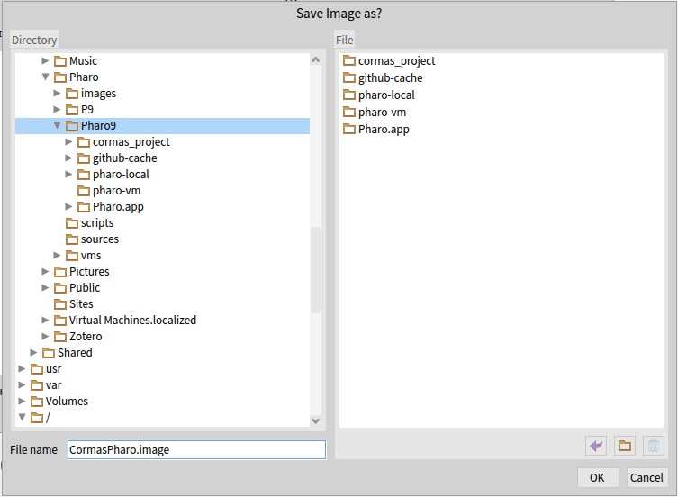

<p align="center">
<h1 align="center">CORMAS</h1>
  <p align="center">
    <b>CO</b>mmon pool <b>R</b>essources and <b>M</b>ulti-<b>A</b>gent <b>S</b>imulations
    <br>
    <a href="https://github.com/cormas/cormas/wiki"><strong>Explore the docs »</strong></a>
    <br>
    <br>
    <a href="https://github.com/cormas/cormas/issues/new?labels=Type%3A+Defect">Report a defect</a>
    |
    <a href="https://github.com/cormas/cormas/issues/new?labels=Type%3A+Feature">Request feature</a>
  </p>
  <p align="center">
    <a href="https://github.com/cormas/cormas/actions/workflows/testCore.yml"></a>
    <a href="https://github.com/cormas/cormas/actions/workflows/test.yml"></a>
    <a href='https://coveralls.io/github/cormas/cormas?branch=master'></a>
    <a href="https://raw.githubusercontent.com/cormas/cormas/master/LICENSE"></a>
    <a href="#contributors-"></a>
    <a href="https://archive.softwareheritage.org/swh:1:dir:7861db8c1b3c19b867c665d86a0b47a8770f1db0;origin=https://github.com/cormas/cormas;visit=swh:1:snp:3de370824e0a4f98589a349bfb1cdecc9c924c41;anchor=swh:1:rev:2fefa18603a0be909aa1701f13050ce105b9fdbd"></a>
  </p>
</p>

# Description

Cormas is a platform for agent-based modelling and simulations implemented in Pharo - a pure object-oriented programming environment.

Cormas was originally developed by the Green research unit (today part of UMR SENS) based on the years of field experience. Cormas was specifically developed to support Companion Modelling (ComMod) - a participatory approach that involves stakeholders in every step of model development and exploration.

Documentation and tutorials about Cormas are available on our website: https://cormas.org

If you want to contribute to CORMAS please have a look to the [contributing guide](https://github.com/cormas/cormas/blob/master/CONTRIBUTING.md).


# Installation

## Standard Installation

> Read our [Installation Guide](https://cormas.org/#/install) for detailed step-by-step instructions on how to install Cormas

* Download the latest stable Pharo image depending of your platform: http://pharo.org/download
* Load Cormas: Open Pharo then select `Browse > Playground` in the top menu. Paste the script below in Playground then click on `Do it` (green button in the top-left coirner of Playground) to execute it:

```st
Metacello new
    repository: 'github://cormas/cormas';
    baseline: 'Cormas';
    load.
```

Use this script if you want the development version of Cormas:

```st
Metacello new
    repository: 'github://cormas/cormas:dev';
    baseline: 'Cormas';
    load.
```

All packages load into the Cormas-* package names:
<p>

## CLI Installation

You can install CORMAS through Unix command line. It works as follow:

```console
# Create a cormas/ directory and navigate into it
mkdir cormas; cd cormas

# Download Pharo 12 image and virtual machine
curl https://get.pharo.org/120+vm | bash

# Install Cormas
./pharo Pharo.image eval "
    Metacello new
        repository: 'github://cormas/cormas/';
        baseline: 'Cormas';
        load.
    Smalltalk snapshot: true andQuit: true"
```

Then you can open your Cormas image with user interface:

```console
./pharo-ui Pharo.image
```

## Saving your image

As you use Cormas, you should always save your image (the state of your environment).
For that, select `Save` from the Pharo menu.

Alternatively, if you want to save your image in a custom location, select `Save As...`:
<p>

Then write the name of your choice (e.g.: `CormasPharo.image`):
<p>

# Contributors ✨

Thanks goes to these wonderful people ([emoji key](https://allcontributors.org/docs/en/emoji-key)):

<!-- ALL-CONTRIBUTORS-LIST:START - Do not remove or modify this section -->
<!-- prettier-ignore-start -->
<!-- markdownlint-disable -->
<table>
  <tr>
    <td align="center"><a href="https://github.com/olekscode"><br /><sub><b>Oleksandr Zaitsev</b></sub></a><br /><a href="https://github.com/cormas/cormas/commits?author=olekscode" title="Code">💻</a> <a href="https://github.com/cormas/cormas/commits?author=olekscode" title="Tests">⚠️</a></td>
    <td align="center"><a href="http://macau.unu.edu"><br /><sub><b>Serge Stinckwich</b></sub></a><br /><a href="https://github.com/cormas/cormas/commits?author=SergeStinckwich" title="Code">💻</a> <a href="https://github.com/cormas/cormas/commits?author=SergeStinckwich" title="Tests">⚠️</a></td>
    <td align="center"><a href="http://tomostavern.blogspot.jp/"><br /><sub><b>Tomohiro Oda</b></sub></a><br /><a href="https://github.com/cormas/cormas/commits?author=tomooda" title="Code">💻</a> <a href="https://github.com/cormas/cormas/commits?author=tomooda" title="Tests">⚠️</a></td>
    <td align="center"><a href="http://elcep.legtux.org/"><br /><sub><b>Etienne DELAY</b></sub></a><br /><a href="https://github.com/cormas/cormas/commits?author=ElCep" title="Code">💻</a> <a href="https://github.com/cormas/cormas/commits?author=ElCep" title="Tests">⚠️</a></td>
    <td align="center"><a href="https://github.com/hernanmd"><br /><sub><b>Hernán Morales Durand</b></sub></a><br /><a href="https://github.com/cormas/cormas/commits?author=hernanmd" title="Code">💻</a> <a href="https://github.com/cormas/cormas/commits?author=hernanmd" title="Tests">⚠️</a></td>
    <td align="center"><a href="http://ur-green.cirad.fr"><br /><sub><b>Pierre Bommel</b></sub></a><br /><a href="https://github.com/cormas/cormas/commits?author=pierbo" title="Code">💻</a></td>
    <td align="center"><a href="https://github.com/ChLePage"><br /><sub><b>Christophe Le Page</b></sub></a><br /><a href="https://github.com/cormas/cormas/commits?author=ChLePage" title="Code">💻</a></td>
  </tr>
  <tr>
    <td align="center"><a href="http://symbios.io"><br /><sub><b>Cédrick Béler</b></sub></a><br /><a href="https://github.com/cormas/cormas/commits?author=cdrick65" title="Code">💻</a></td>
    <td align="center"><a href="https://github.com/nbecu"><br /><sub><b>nbecu</b></sub></a><br /><a href="https://github.com/cormas/cormas/commits?author=nbecu" title="Code">💻</a></td>
    <td align="center"><a href="https://github.com/npapoylias"><br /><sub><b>npapoylias</b></sub></a><br /><a href="https://github.com/cormas/cormas/commits?author=npapoylias" title="Code">💻</a> <a href="https://github.com/cormas/cormas/commits?author=npapoylias" title="Tests">⚠️</a></td>
    <td align="center"><a href="https://github.com/brun0"><br /><sub><b>Bruno Bonté</b></sub></a><br /><a href="https://github.com/cormas/cormas/commits?author=brun0" title="Code">💻</a></td>
    <td align="center"><a href="https://github.com/jigyasa-grover"><br /><sub><b>Jigyasa Grover</b></sub></a><br /><a href="https://github.com/cormas/cormas/commits?author=jigyasa-grover" title="Code">💻</a></td>
    <td align="center"><a href="http://peteruhnak.com/blog"><br /><sub><b>Peter Uhnak</b></sub></a><br /><a href="#tool-peteruhnak" title="Tools">🔧</a></td>
    <td align="center"><a href="https://github.com/gabrami34"><br /><sub><b>Géraldine Abrami</b></sub></a><br /><a href="https://github.com/cormas/cormas/commits?author=gabrami34" title="Tests">⚠️</a></td>
  </tr>
</table>

<!-- markdownlint-restore -->
<!-- prettier-ignore-end -->

<!-- ALL-CONTRIBUTORS-LIST:END -->

This project follows the [all-contributors](https://github.com/all-contributors/all-contributors) specification. Contributions of any kind welcome!

## Historical contributors

Innocent Bakam, François Bousquet, Alassane Bah, Emmanuel Lieurain, Jean-Christophe Soulié, Paul Guyot, Jean-François Lefevre, Anne Dray.
