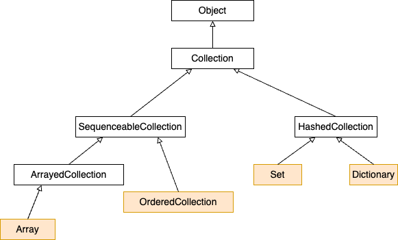

# Collections in Pharo

## Collections Types

The Pharo language offers various collection, however we will focus on four main which are mostly use in Cormas plateform: **Array**, **OrderedCollections**, **Set**, and **Dictionary**. The figure below illustrates a section of the Collection Hierarchy. Due to this hierarchy, collections share certain properties and methods.



### 1. Array
An Array is a fixed-sized collection of elements accessed by integer indices. Contrary to the C convention in Pharo, the first element of an array is at position **1 and not 0**. Arrays are fixed-size collections therefore we cannot add or remove elements at the
end of an array. The following code snippet demonstrates four ways to instantiate an array of 3 elements, using the messages `with:`, `withAll:`, `at:put:`, and dynamic creation which allow the interpretation of array elements `[{ var . var + 1 }]`. for this latest approach the elements inside the array are executed.

```smalltalk
anArray1 := Array with: 1 with: 2 with: 3. "#(1 2 3)"

anArray2 := Array withAll: #(4 5 6).  "#(4 5 6)"

anArray3 := Array new: 3.
anArray3 at: 1 put: 7.
anArray3 at: 2 put: 8.
anArray3 at: 3 put: 9.
anArray3 . "#(7 8 9)"

anArray4 := {4+1. 3. ('hello',' world')}. "#(5 3 'hello world')"
```
Elements in an array can be accessed using the message `at: anIndex`. For example, in the array `anArray4` created below, we access the element at index 3 in the following code.
```smalltalk
anArray4 at:3. "'hello world'"
```
### 2. OrderedCollection
OrderedCollection is one of the collections that can grow, and to which
elements can be added sequentially. It offers a variety of messages such as
`add:`, `addFirst:`, `addLast:`, and `addAll:`.
We can create an `OrderedCollection` by instantiating the OrderedCollection class and using the messages to add elements. The following snippet show the creation of an OrderedCollection and the use of basic methods to add elements at various positions.
```smalltalk
ordCol := OrderedCollection new. "an OrderedCollection()"
ordCol add: 'bob'; add: 'alice'; yourself . "an OrderedCollection('bob' 'alice')"
ordCol addFirst: 'matheo'; yourself . "an OrderedCollection('matheo' 'bob' 'alice')"
ordCol addLast: 'Pierre'; yourself . "an OrderedCollection('matheo' 'bob' 'alice' 'Pierre')"
```
Elements in an OrderedCollection can be accessed using the message `at: anIndex`. To remove an element, we use the message `remove: anObject`, which removes the first occurrence of `anObject` in the collection. For example, in the code below, we demonstrate accessing and removing the first element 'matheo'.
```smalltalk
ordCol at: 1. "'matheo'"
ordCol remove: 'matheo'; yourself . "an OrderedCollection('bob' 'alice' 'Pierre')"
```
If we remove an elements which is not in the collection we will have a **NotFound** exception, to avoid program freezing we can use the message `remove: anObject ifAbsent: aBlock`. We already delete 'matheo' we can throught the following snippet use the message and avoid the exception by execution the block.
```smalltalk
ordCol remove: 'matheo' ifAbsent: ['element is absent']. "'element is absent'"
```
### 3. Dictionary
Dictionaries are important collections whose elements are accessed using
keys. Dictionaries compare keys by equality. Among the most commonly used messages of dictionary you will find
`at: aKey`, `at: aKey put: aValue`, `at: aKey ifAbsent: aBlock`, `keys`,
and `values`.
The following code snippet demonstrates how to create a dictionary containing three colors, how to list its keys and values, and how to access elements using their keys.

```smalltalk
colors := Dictionary new.
colors at: #blue put: Color blue;
       at: #white put: Color white;
       at: #red put: Color red; yourself. "a Dictionary(#blue->Color blue #red->Color red #white->Color white )"

colors keys. "#(#red #blue #white)"
colors values. "{Color red. Color blue. Color white}"
colors at: #blue. "Color blue"
```

A dictionary can be viewed as a collection of (key, value) pairs, created using the `->` operator. Therefore, we can also create a dictionary using the following syntax.
```smalltalk
colors := Dictionary newFrom: { #blue -> Color blue . #white -> Color white . #red -> Color red }. "a Dictionary(#blue->Color blue #red->Color red #white->Color white )"
```
To remove an element, you can use the message `removeKey: anKey`.
```smalltalk
colors removeKey: #blue.
colors "a Dictionary(#red->Color red #white->Color white )"
```

### 4. Set
The class Set is a collection which behaves as a mathematical set, i.e., as a
collection with no duplicate elements and without any order. In a Set, elements are added using the message `add:` and they cannot be accessed using the message `at:`. Elements of a Set are accessed using **iterators**. The following code snippet show the creation of two sets, where each element in the set is unique within the collection.
```smalltalk
set1 := Set new.
set1 add:4/2; add: 2; add:3; yourself. "a Set(2 3)"
set2 := Set newFrom: #(4 5 6). "a Set(4 5 6)"
```
### Collections Conversion
We can convert a collection to another type using messages like `asArray`, `asSet`, and `asOrderedCollection`. There are several reasons to convert between collection types. For example, since sets automatically remove duplicate elements, using the conversion `asSet` can help eliminate duplicates from an Array or OrderedCollection. We can also convert an Array to an OrderedCollection and conversely.
```smalltalk
anArray := Array withAll: #(4 5 6 4 5 6). "#(4 5 6 4 5 6)"
anArray asSet. "a Set(5 6 4)"

ordCol := OrderedCollection new.
ordCol add: 1; add: 2; add: 3; add: 3; yourself . "an OrderedCollection(1 2 3 3)"
ordCol asSet . "a Set(1 2 3)"

anArray asOrderedCollection . "an OrderedCollection(4 5 6 4 5 6)"
ordCol asArray . "#(1 2 3 3)"
```
### Common Collections Messages
There are several messages shared by these collections, such as `size` for collection size, `isEmpty` to check if the collection is empty, `ifEmpty: aBlock` / `ifNotEmpty: aBlock` to execute instructions based on whether the collection is empty or not, `includes: anObject` to test if an element is in the collection, and `sort:` to sort a collection in ascending order.
```smalltalk
nbrs := #(2 1 7 4 10) asOrderedCollection.

nbrs size. "5"
nbrs isEmpty . "false"
nbrs ifNotEmpty: [ self inform: 'not empty'].
nbrsSorted := nbrs sort: [ :a :b | a < b  ].
nbrsSorted. "an OrderedCollection(1 2 4 7 10)"
nbrs includes: 10. "true"
```

## Collections Iterators
In Pharo loops and conditionals are simply messages sent to collections or
other objects such as integers or blocks. In addition to low-level messages such as `to:do:` which evaluates a
block with an argument ranging from an initial to a final number, the collection hierarchy offers various high-level iterators. Using such iterators will make your code more robust and compact.

### 1. Iterating `do:`
The method `do:` is the basic collection iterator. It applies its argument (a
block taking a single argument) to each element of the receiver.
There are a lot of variants of `do:`, such as `do:without:`, `doWithIndex:` and `reverseDo:`. 
- For the indexed collections (Array, OrderedCollection) the message `doWithIndex:` also gives access to the current index. For ordered collections, the message `reverseDo:` walks the collection in the reverse order. 
- When the message `do:` is sent to a dictionary, the elements taken into account are the values, not the associations. The proper messages to use are `keysDo:`, `valuesDo:`, and `associationsDo:`, which iterate respectively on keys, values or associations.

The following snippet demonstrates the usage of `do:` and its variants across different types of collections.
```smalltalk
"Display the elements of an OrderedCollection in the transcript"
#('bob' 'alice' 'toto') do: [:each | Transcript show: each; cr ]. 

"Get the index of the array element that contains 'alice'"
#('bob' 'alice' 'toto')
   	doWithIndex: [ :each :i | (each = 'alice') ifTrue: [ ^ i ] ]. "2"
	
"Display the elements of an OrderedCollection in reverse order in the transcript."
ordCol := OrderedCollection new; with: 'bob' with: 'alice' with: 'toto'. 
ordCol reverseDo: [ :each | Transcript show: each; cr ].

"Iterate through the dictionary and display each element in the transcript"
colors := Dictionary newFrom: { #blue -> Color blue. #white ->
    Color white. #red -> Color red }.
colors keysDo: [ :key | Transcript show: key; cr ].
colors valuesDo: [ :value | Transcript show: value; cr ].
colors associationsDo: [:value | Transcript show: value; cr].
```
### 2. Collecting results `collect:`
The message `collect:` executes its argument block for each element and returns a new collection containing the results. 
> Actually `collect:` is not guaranteed to return a collection of exactly the same class as the receiver, but only the same species.

``` smalltalk
"Apply the abs message, which returns the absolute value."
#( 2 -3 4 -35 4 -11) collect: [ :each | each abs ] "#(2 3 4 35 4 11)"
```
### 3. Selecting and Rejecting elements
The message `select:` returns the elements of the receiver that satisfy a particular condition, the message `reject:` does the opposite.
``` smalltalk
"Select all prime numbers between 2 and 20"
(2 to: 20) select: [ :each | each isPrime ]. "#(2 3 5 7 11 13 17 19)"
"Exclude all prime numbers between 2 and 20"
(2 to: 20) reject: [ :each | each isPrime ] "#(4 6 8 9 10 12 14 15 16 18 20)"
```
### 4. Identifying an element with `detect:`
The message `detect:` returns the first element of the receiver that matches
block argument.
``` smalltalk
" Return the first Vowel"
'through' detect: [ :each | each isVowel ]. "$o"
```
### 5. Accumulating results with `inject:into:`
Functional programming languages often provide a higher-order function called fold or reduce to accumulate a result by applying some binary operator iteratively over all elements of a collection. In Pharo this is done by `inject:into:`.
```smalltalk
"A block that calculates the factorial"
factorial := [ :n | (1 to: n) inject: 1 into: [ :product :each |
             product * each ] ].
factorial value: 10 "3628800"
```
### 6. Other messages
- `anySatisfy:` this message answers `true` if at least one element of the collection satisfies the condition represented by the argument.
- `include:` checks whether the argument is contained in the collection.
- `count:`returns the number of elements satisfying a condition. The condition is represented as a boolean block.
- `noneSatisfy:` answers false if at least one elements of the collection satisfies the condition represented by the argument.

```smalltalk
nbrs := #(1 2 4 7 10).

nbrs count: [ :n | n isPrime ]. "2"
nbrs includes: 1.  "true"
nbrs anySatisfy: [ :n | n isPrime ]. "true"
nbrs noneSatisfy: [:n |n isPrime].  "false"
```