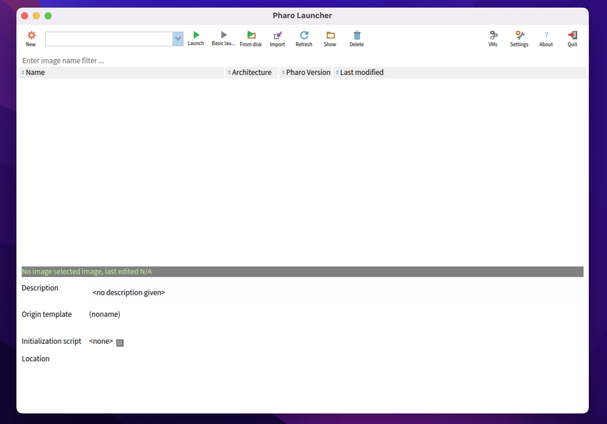
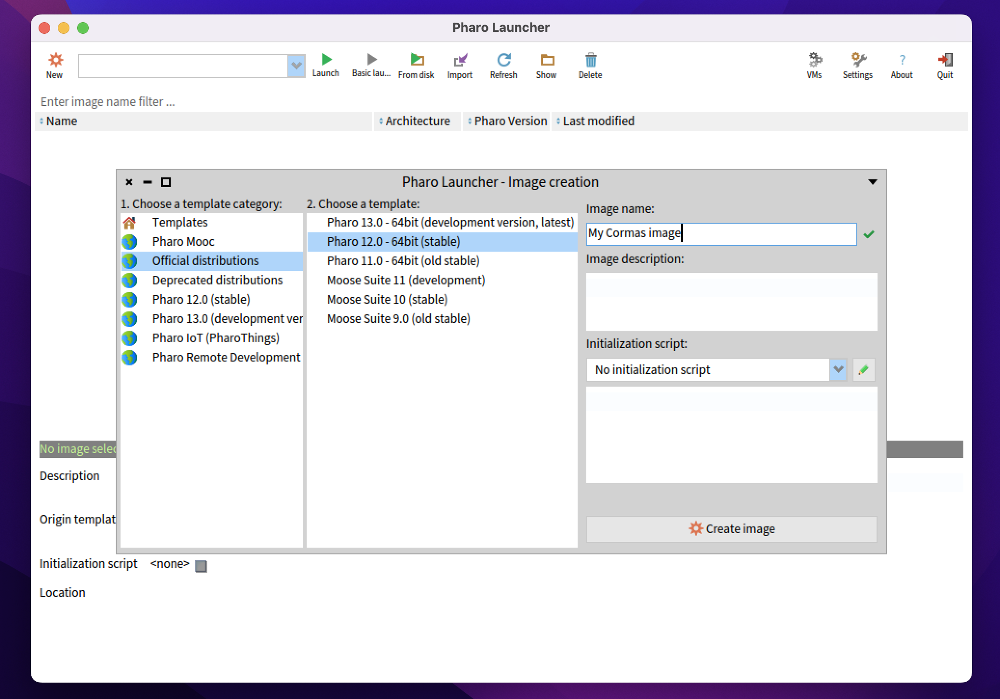
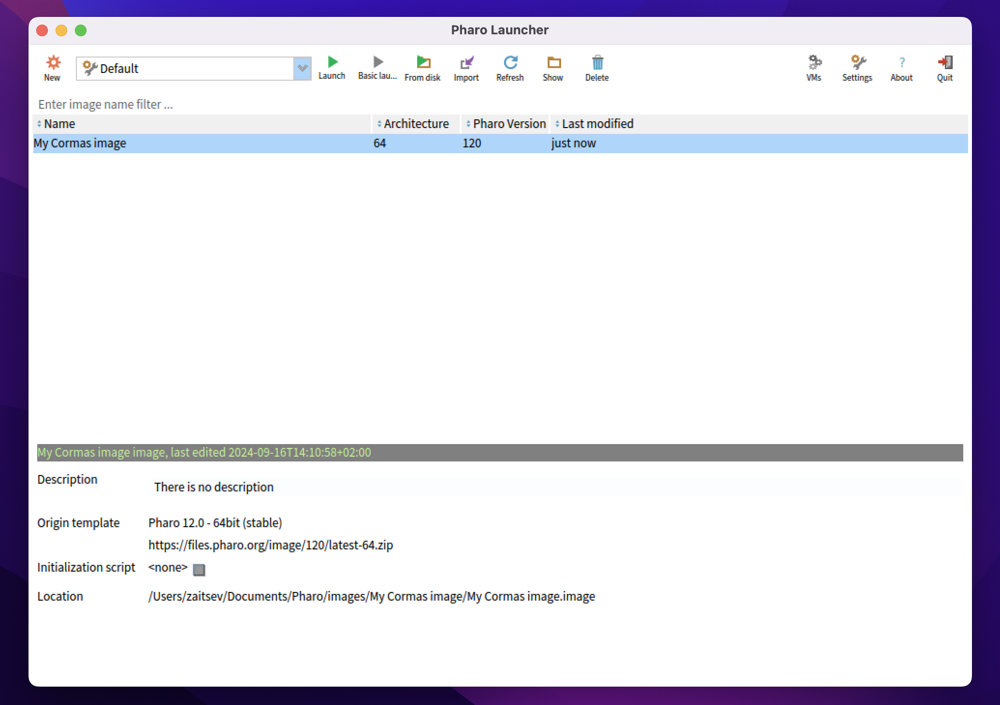
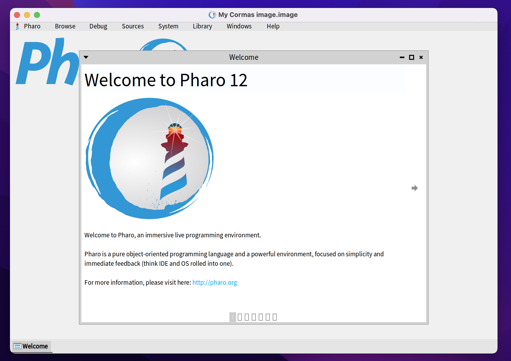
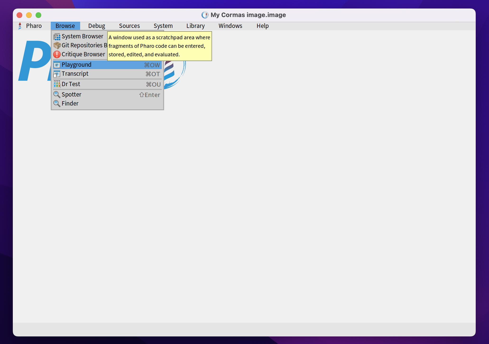
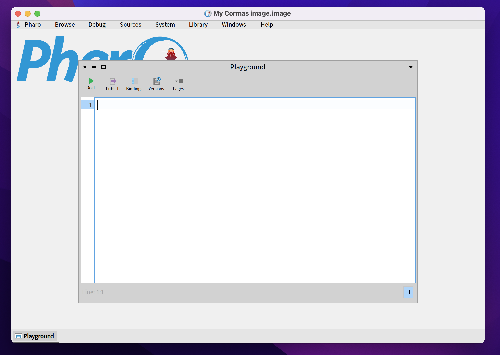
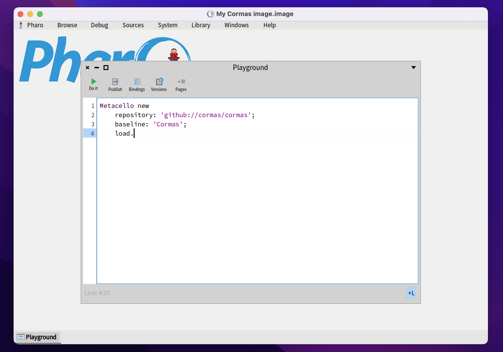
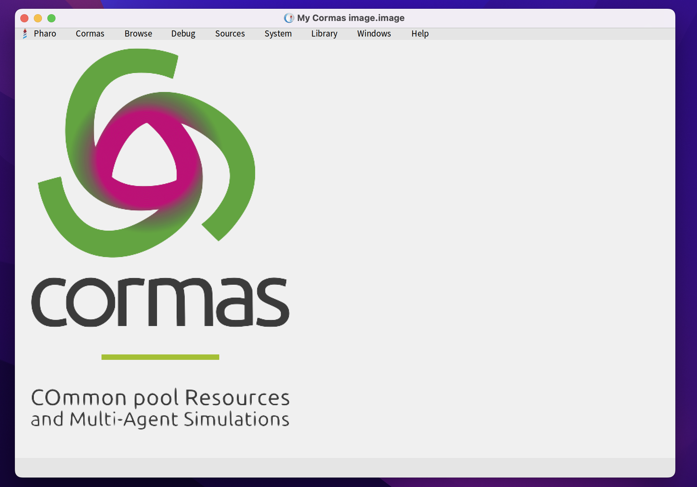

# How to Install Cormas

Cormas is an agent-based modelling and simulation platform running on top of the Pharo programming environment. To install Cormas, you must first install Pharo, create a new image, and then run the installation script to load Cormas. This chapter will guide you through this process.

> **TL;DR** If you are not new to Pharo, just run this script in the Playground and you're done :smile:
> 
> ```smalltalk
> Metacello new
    repository: 'github://cormas/cormas';
    baseline: 'Cormas';
    load.
> ```

## Installing Pharo

The steps below will help you install Pharo Launcher and create a Pharo image. If some of those steps fail on your computer, please contact us on Discord (see [How to get help](contact)).
If you are an advanced user, you can also try to install Pharo from command line or download the standalone packages by following the instructions on https://pharo.org/download.

### Step 1: Install Pharo Launcher

The easiest way to install and run Pharo is with **Pharo Launcher** - an application that can be used for creating and managing Pharo images. It can be downloaded from [https://pharo.org/download](https://pharo.org/download). Follow the instructions on the website to install Pharo Launcher on your computer. Once the installation is complete, open Pharo Launcher. You should see the window similar to the one below. Click on the _"New"_ button to create a new Pharo image.



### Step 2. Create a Pharo image
	
Cormas always supports three latest versions of Pharo: the development version (at the moment, it's Pharo 13), the stable version (Pharo 12), and the old stable version (Pharo 11). Unless you have a reason to do otherwise, we recommend you to always use the latest stable version, in this case, Pharo 12.
In the dialog window of Pharo Launcher, select the version of Pharo **(1)**, give your image a name **(2)**, and then click on the _"Create image"_ button **(3)**.

> **Note:** Pharo Launcher automatically detects the architecture of your processor: 64-bit or 32-bit. In case if you see both types of images offered to you by Pharo Launcher, you must manually check what of processor you have. Most modern computers have 64-bit processors.



### Step 3. Open your image

When new image is created, it will open automatically.
If it didn't, or if you are opening Pharo for the second time, you can open your image simply by double-clicking on it or by selecting it and clicking the _"Launch"_ button in the top menu.



When the image launches, you



## Installing Cormas





```smalltalk
Metacello new
    repository: 'github://cormas/cormas';
    baseline: 'Cormas';
    load.
```



