# Foraging robots Tutorial

In this tutorial, you will learn how to build a very simple model in Cormas.

## General presentation
This model is inspired by an article by Steel (1989) in which robots are tasked with recovering ore from the environment and bringing it back to a specific location. Steel explains: 
The paper discusses some issues in the cooperation between distributed agents using the following case study: The objective is to explore a distant planet, more concretely to collect samples of a particular type of precious rock. The location of the rock samples is unknown in advance but they are typically clustered in certain spots. There is a vehicle that can drive around on the planet and later reenter the spacecraft  to go back to earth. There is no detailed map of the terrain although it is known that the terrain is full of obstacles, hills, valleys, etc.

The case study is designed to require autonomy. It is not feasible to plan and steer the whole thing out of earth because communication from and to the planet has a considerable time delay and may be cut off during certain periods. Although one solution could be that the vehicle itself wanders around and collects the rocks, it is obvious that a larger terrain could be covered much more quickly if there is a group of mobile robots that perform the task of searching and carrying the rocks to the vehicle. This would make the solution also less fault-tolerant because loss of one robot is not fatal. Because the desired samples are clustered in certain spots, the robots better cooperate to accomplish the task. This give us the problem addressed in this paper : how can these distributed robots cooperate to find samples and to carry them to the collecting vehicle. If the present case study seems somewhat far fetched, the cleanup of toxic waste or household garbage collection can be viewed as comparable talks.

Steels, Luc. 1989. Cooperation Between Distributed Agents Through Self-Organisation. Pages 175–196 of : Demazeau, Yves, & Müller, Jean-Pierre (eds), Decentralized A.I. : Proceedings of the First European Workshop on Modelling Autonomous Agents in a Multi-Agent World (MAAMAW-89), Cambridge, England, August. Amsterdam, North-Holland : Elsevier Science Publishers.
This paper is available [here](https://citeseerx.ist.psu.edu/document?repid=rep1&type=pdf&doi=3d79478898cb3c67b6a66675577334bd5286ec01). 

For the first version of this tutorial, the model the model has been made even simpler: the base to recover all the ore is not considered. Robots do not have a maximum capacity and do not leave marks when carrying ore.
Here is a class diagram for this version:

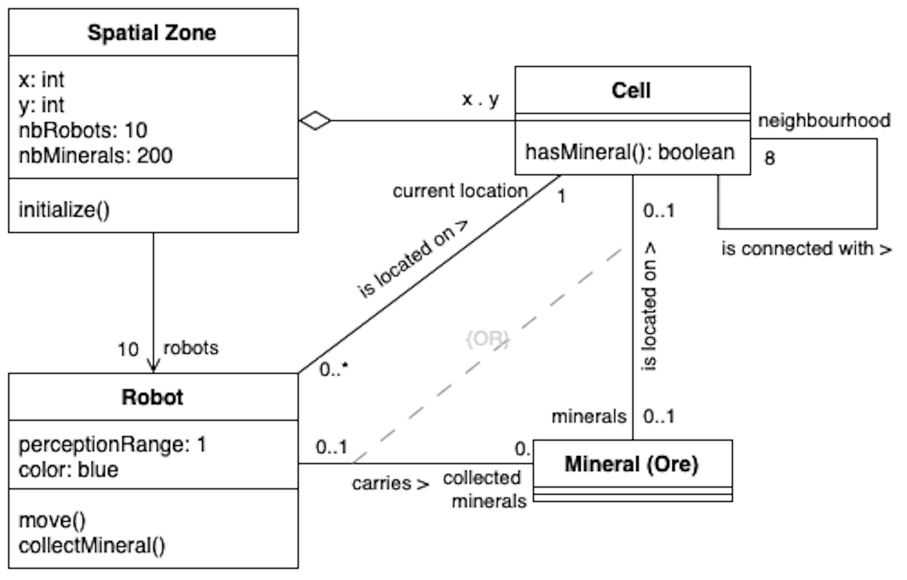 
<sup>UML class diagram of the model</sup> 

As the spatial zone is the full grid of the space, this model is composed of three elements:

1. A square grid of cells
2. Minerals that can be located in those cells
3. Robots that move across the cells and collect minerals

The complete implementation can be found in our [robot-forager-model](https://github.com/cormas/robot-forager-model/tree/main/src/RobotForager-Model) repository.

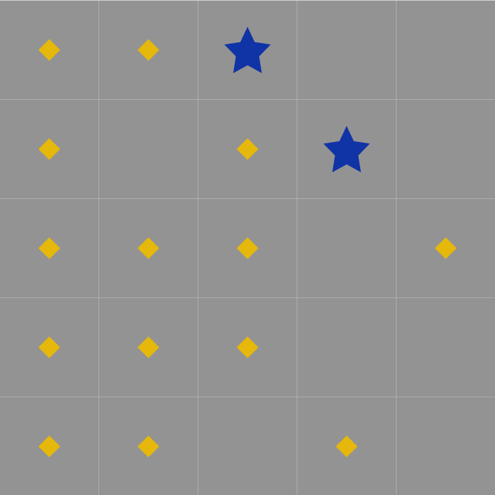
<sup>Example of space with 2 foraging robots</sup> 

To make the model description more precise:

- Multiple robots should never appear on the same cell
- Multiple minerals should never appear on the same cell
- When model is initialized, first we generate robots and then minerals. A mineral cannot be generated on a cell where robot is located.

At each simulation step, all robots perform two actions:

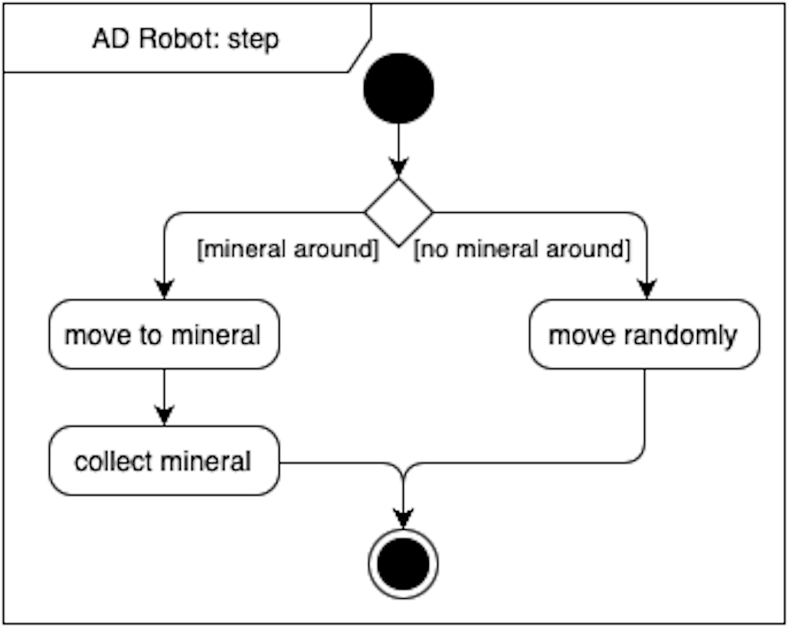 
<sup>Activity diagram of the step of a robot</sup> 


- **Move.** Look around at 8 neighbor cells, if any one of them contains a mineral, move to that cell. If no neighbor has minerals, then move randomly to any of the 8 neighbors.
- **Collect minerals.** Look at the cell on which robot is located (after moving). If this cell has a mineral, then collect it (add it to robot’s inventory and remove it from the cell)
Otherwise do nothing.

Robots perform their actions asyncronously, meaning that as soon as the robot sees a mineral, it moves to the nighbour cell and collects the mineral, without waiting for other robots to make their decision. If this was not the case, we could arrive at a situation when two robots move to the same cell to collect the same mineral.

We will implement two environments: 

- **Small environment:** 5x5 cells, 2 robots, 20 minerals
- **Large environment:** 27x27 cells, 10 robots, 200 minerals.

## Step 1. Create a new model 

If you haven't donne so already, you can [Install Cormas](install) then open a Cormas image. Click on _"Cormas"_ menu in the top left corner and select _"New Model"_.

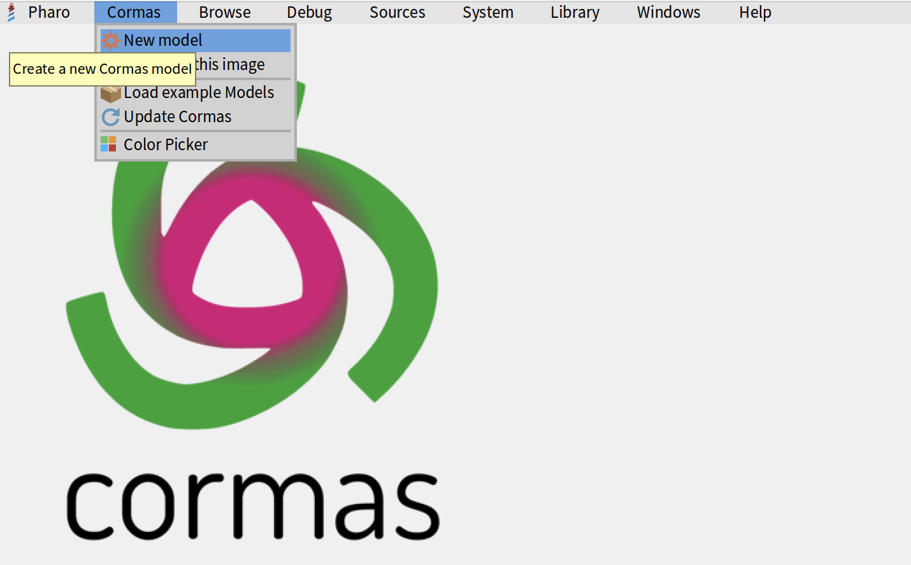 

Type the name of your model. In our case, we will call it _"Robot Forager"_. All classes in Pharo exist in the same namespace, which means that every class must have a unique name. To ensure this, we follow a good practice of adding a project-specific prefix to every class name. Cormas will automatically suggest a prefix for your model classes, in our case, it suggests _"RF"_. Feel free to edit this prefix. In the bottom part of the window, you will see the packages and classes that will be generated for you. By default, Cormas will also generate test classes, but we will not use them in this tutorial, which is why we uncheck the _"Create a test package"_ checkbox. We also add a simple description for our model using [Microdown](https://github.com/pillar-markup/Microdown) (you can also write it in Markdown or in plain text).

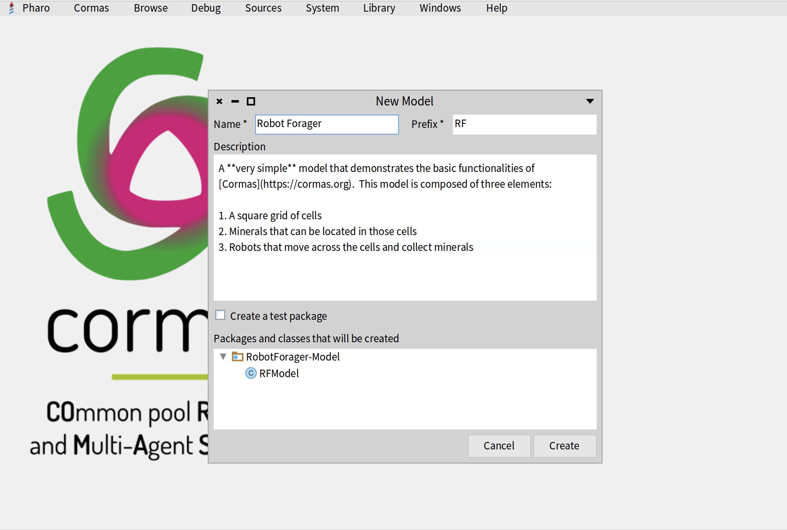 

Once you click on _"Create"_ button, Cormas will generate a package `RobotForager-Model` and a class `RFModel`. If everything goes well, a System Browser will open on this new class. Now we can start coding!

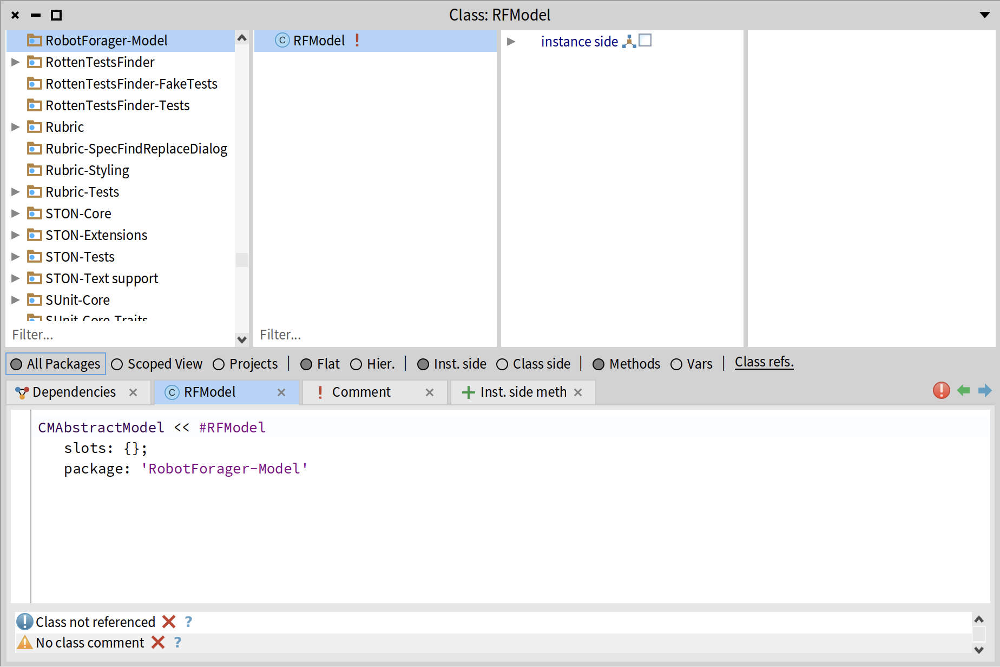 

## Step 2. Create a Cell class

We will start by creating a class for a cell of our spatial grid. Cell will define a location where robots and minerals can be located. To create a new class, you can right-click on any of the existing classes and select _"New class"_ from the menu. You will see a window with a template class definition.

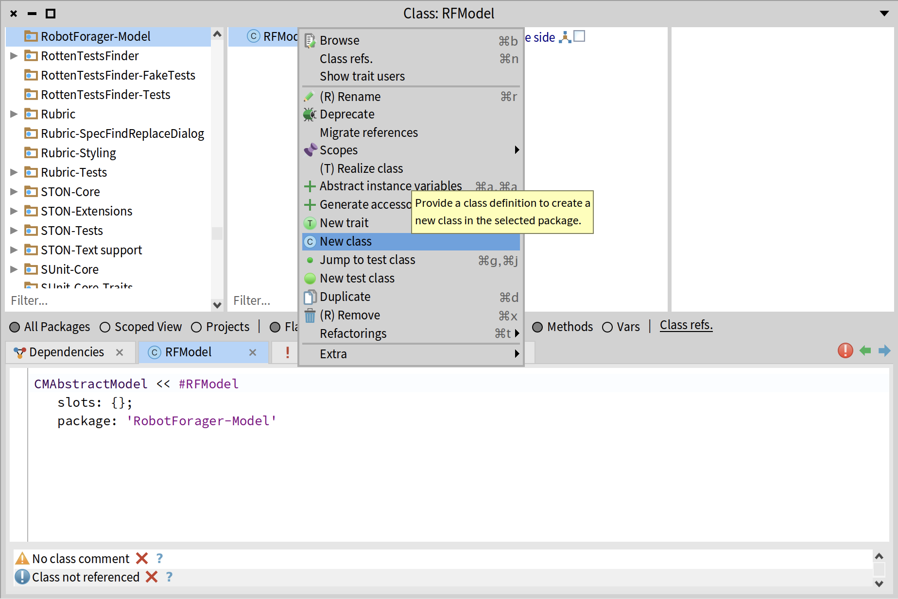 

Alsternatively, you can edit the definition of any existing class in the bottom part of the System Browser. As soon as you change the name and hit _"Save"_ (`Ctrl+S` on Windows and Linux or `Cmd+S` on Mac), the new class will be created.

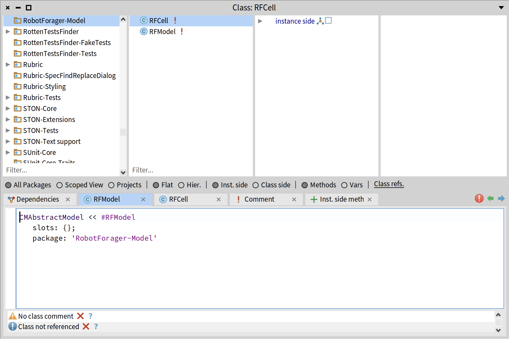 

In our case, the cell class will be called `RFCell` (remember to use the prefix!) and it will be the subclass of `CMSpatialEntityElement` - a default superclass for spatial cells in Cormas.

```smalltalk
CMSpatialEntityElement << #RFCell
	slots: {};
	package: 'RobotForager-Model'
```

In our model, cells will do nothing, which is why we do not need to implement any methods for this class. By default, cells will be represented as gray squares.

We must now create a collection of cells in our model. To do that, we must edit a class definition of `RFModel` and add a new slot (instance variable). We will call it `cells` but you can choose any name you like.

```smalltalk
CMAbstractModel << #RFModel
    slots: { #cells };
    package: 'RobotForager-Model'
```

Now we will create some methods in `RFModel` class. To add a new method, click on _"instance side"_ in the third pane of the System Browser and then edit the method template in the bottom part. You can also create a new mthod by editing the code of any existing method. As soon as you change the name, the new method will be created.

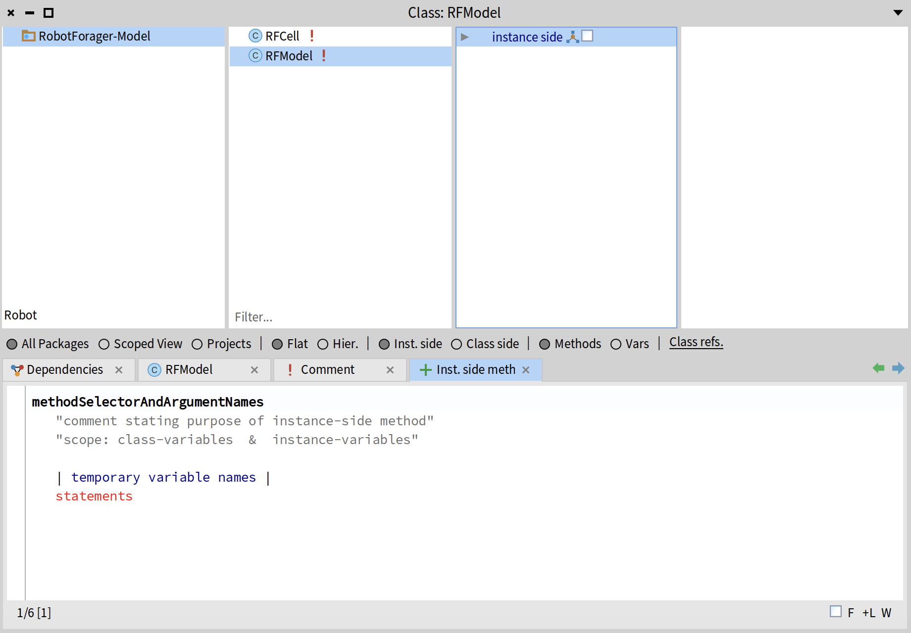

First, we create an `initialize` method and initialize the `cells` variable with an empty collection. Cormas will populate this collection with actual cells once we define a spatial grid in the next section. Remember that the `RFModel >>` part is just an indication for you that this method should belond to the `RFModel` class. You must not type this part in the System Browser.

```smalltalk
RFModel >> initialize
	super initialize.
	cells := OrderedCollection new.
```

Now we must create a getter accessor for the `cells` collection. We add a pragma `<getterFor: #ClassName>` to tell Cormas that this getter is linked to the `RFCell` class.

```smalltalk
RFModel >> cells
	<getterFor: #RFCell>
	^ cells
```

## Step 3. Create a grid

Now we are ready to create a spatial grid and have a first look at our simulation. To do that, we must add two methods to our model class: at least one _"init"_ method which defines the initial scenario for our simulation and at least one _"control"_ method which defines what happens at each step of the simulation.

As we discussed at the beginning of this tutorial, we want to implement two environments: a big one with 27x27 grid and a small one with 5x5 grid. We will start with the small environment. Create a new method in the `RFModel` class and call it `initSmall`. We must add a pragma `<init>` to tell Cormas that this is one of the _"init"_ methods. Then we use a method provided by the superclass to define the spatial grid. We specify the number of rows and columns, the size of the neighbourhool (in this case, there are two options: 4 or 8; neighbourhood of size 4 means that only north, south, east, and west cells are considered as neighbours; neighbourhood of size 8 includes diagonal cells such as north-east, north-west, etc.). Finally, we pass `true` as a last parameter telling Cormas that the environment should be closed - the agents won't be able to walk over the edge of the grid (if the environment is _"open"_, the agents can cross the left edge and appear on the right or cross the top edge and appear in the bottom. 

```smalltalk
RFModel >> initSmall
	<init>
	self
		createGridNumberOfRows: 5
		numberOfColumns: 5
		neighbourhood: 8
		closed: true.
```

We must create at least one _"control"_ method. We will call it `step` and leave it empty for now. We add a pragma `<control>` to tell Cormas that this is one of the control methods.

```smalltalk
RFModel >> step
	<control>
	"do nothing"
```

## Step 4. First look at a simulation

Now we can open the simulation view and take a first look at our model. Select _"Models in this image"_ from the _"Cormas"_ menu in the top left corner.

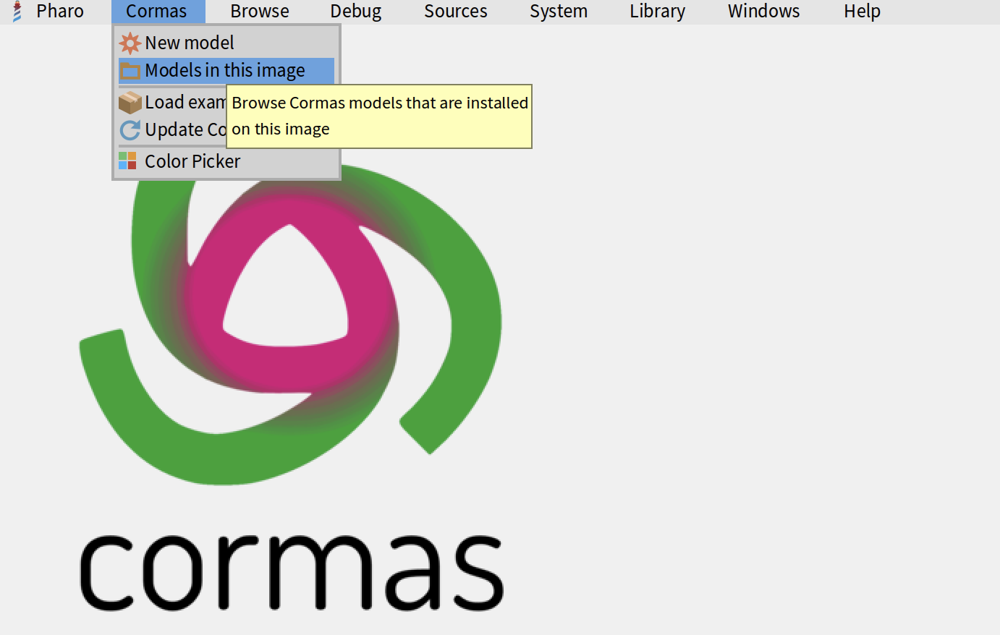

Then select your model from the list (in our case, it's `RFModel`) and click on _"Open Simulation"_ button.


You will see the Cormas Simulation browser. The left side allows you to initialize the simulation. Here you can select the _"init"_ and _"control"_ methods that will be executed, fix the random seed, modify parameters of the model (we don't have any parameters at this point). The right side of the window is currently empty because the simulation was not initialized yet.

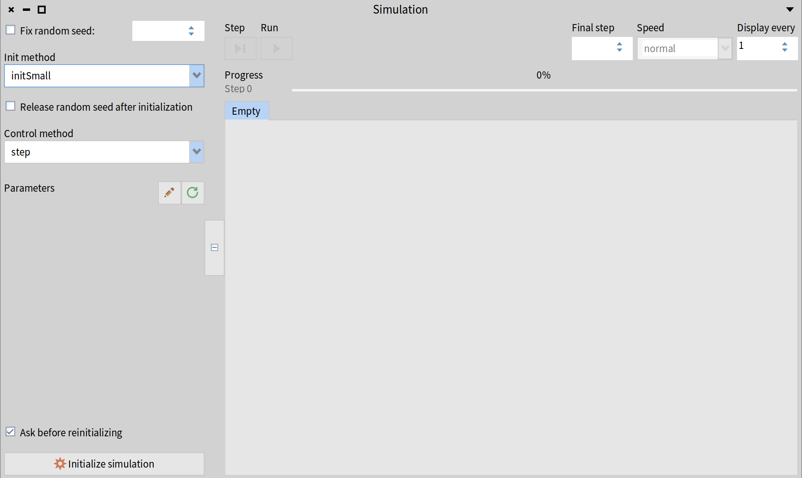

In our case, we have only one _"init"_ method: `initSmall` anb only one _"control"_ method: `step`. They are selected by default, so you can simply click the _"Initialize simulation"_ button. You will see a 5x5 grid with instances of `RFCell` class that were created in the `initSmall` method. Every cell is gray because this is the default color in Cormas. If you click on _"Step"_ button in the top part of the Simulation window, the _"control"_ method (in this case, `step`) will be executed. Our `step` method is empty, so nothing will happen.

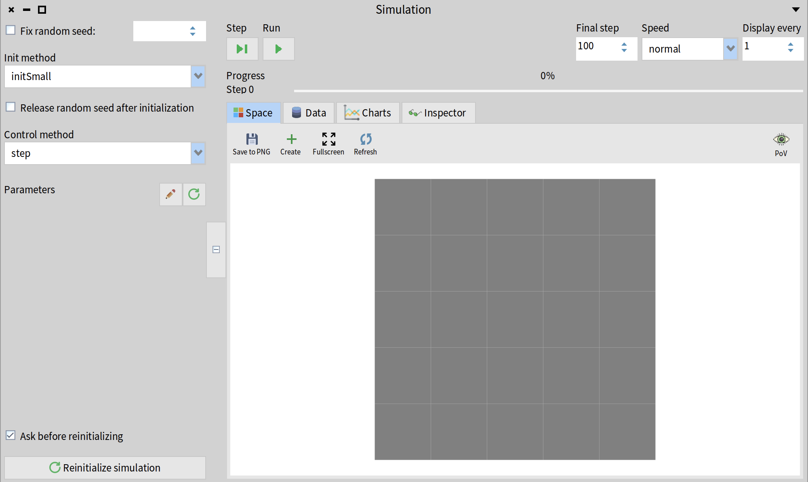

Every cell is a live object, you can right-click on it and select _"Inspect"_ from the menu. This will open an interactive inspector for the selected cell.

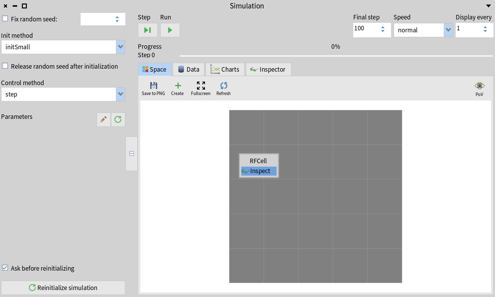

You can also select the _"Inspector"_ tab of the Simulation window. This will open the inspector of the simulation object. This object has an instance variable called `cormasModel`. If you click on it, you will open an inspector of your `RFModel` instance in a separate pane. If you click on the `cells` variable, you will inspect the collection of cells.

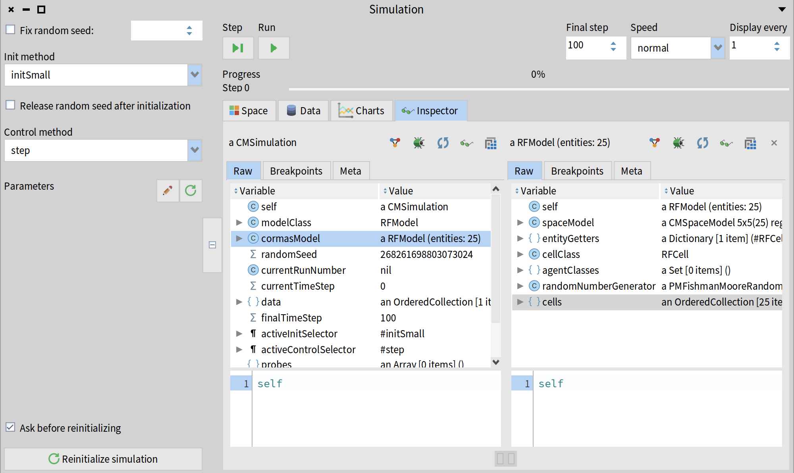

## Step 5. Add robots

Open SystemBrowser again and create a new class called `RFRobot`. It should be a subclass of `CMAgent` - a common superclass for all Cormas agents. Since we want our agent to be located on the grid, we will use the trait `TCMLocated` which will insert all the methods for spatial interaction into our class. [Traits](https://github.com/pharo-open-documentation/pharo-wiki/blob/master/General/Traits.md) are composable units of behavior that are used in Pharo as an alternative to multiple inheritance. They allow us to group methods related to certain functionalities and reuse them in classes that belong to different inheritance hierarchies.

```smalltalk
CMAgent << #RFRobot
	traits: {TCMLocated};
	slots: {};
	package: 'RobotForager-Model'
```

We add a _"pov"_ (point of view) method to describe how the agent should be visualized on the grid. Cormas allows you to define many different points of view methods and change them while the simulation is running. We will call this method `pov` but you can choose any name you like. The only requirement is to include a `<pov>` pragma. Our method will return an instance of a `CMPointOfView` class specifying that the color of our agents should be blue, the shape should be a _"star"_, and the size should be 0.6 (60% of the cell; default size is 0.3). We will use the colors defined in `CMColor` class instead of the standard Pharo `Color` because they are more aesthetic.

```smalltalk
RFRobot >> pov
	<pov>
	^ CMPointOfView
		color: CMColor blue
		shape: #star
		size: 0.6
```

Now we must add robots to our model and tell Cormas how to instantiate them. First, we add an instance variable `robots` to our `RFModel` class.

```smalltalk
CMAbstractModel << #RFModel
	slots: { #cells . #robots };
	package: 'RobotForager-Model'
```

We update the `initialize` method to assign an empty `OrderedCollection` to this variable.

```smalltalk
RFModel >> initialize
	super initialize.
	cells := OrderedCollection new.
	robots := OrderedCollection new
```

Then we define a getter accessor for this collection. Remember to include the `<getterFor:>` pragma.

```smalltalk
RFModel >> robots
	<getterFor: #RFRobot>
	^ robots
```

Now we add one line to the end of our `initSmall` method telling Cormas to create two robots located randomly on the grid but only in those cells that are not occupied by other agents (the cells where robots would be _"alone"_.

```smalltalk
RFModel >> initSmall
    <init>
    self
        createGridNumberOfRows: 5
        numberOfColumns: 5
        neighbourhood: 8
        closed: true.

	self createN: 2 randomlyLocatedAloneEntities: RFRobot
```

Now, when you open (or simply re-initialize) your simulation, you should see two robots located somewhere on the grid.

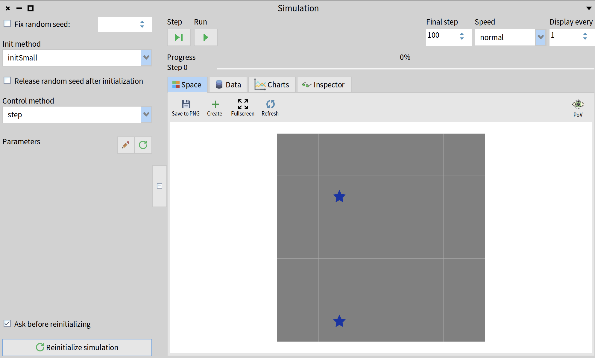

Congratulations! You have created your first agents :) At this point, they are not doing anythig other than simply "exist" in your simulation. In the next step, we will define a first action for our robots.

## Step 6. Make robots move

Actions are special methods that autonomous agents can _"perform"_ during the simulation. The first action that we will define for our robots will be called `moveRandomly` - as the name suggests, it will make robots move randomly on the spatial grid. We add a pragma `<action>` to tell Cormas that this is an _"action"_ method. We will call a method `randomWalk` provided by the trait `TCMLocated`. This method will make simply select a random neighbouring cell and make the robot move there.

```smalltalk
RFRobot >> moveRandomly
	<action>
	self randomWalk
```

Now we modify the `step` method of `RFModel` to ask all robots to move randomly at each step of the simulation.

```smalltalk
RFModel >> step
    <control>
    robots do: [ :each | each moveRandomly ]
```

You can now come back to your simulation and click on the _"Step"_ button (1) to perform one step. You can also click on the _"Run"_ button (2) to make the simulation run for the given number of steps at a given speed.

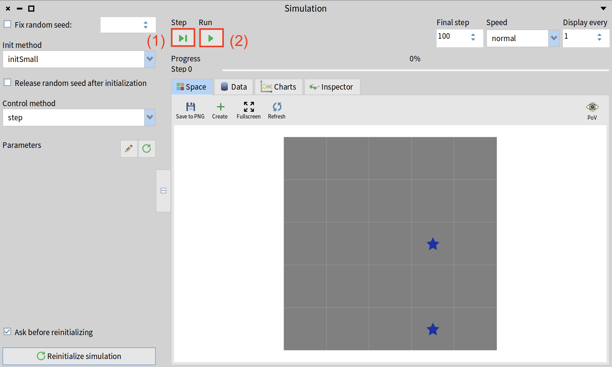

Since we added the `<action>` pragma to the `moveRandomly` method, Cormas has added it to the list of actions available to robots. If you right-click on any robot on the spatial grid, a menu will pop-up allowing you to perform this action. You can also _"Kill"_ a robot (destroy it and remove it from the simulation) or drag-n-drop it to a different location.

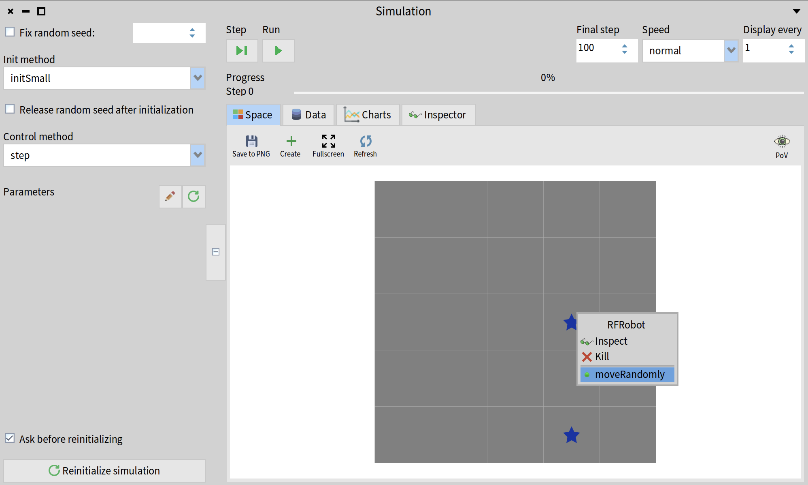

If you run the simulation long enough, you will notice a problem: sometimes robots move randomly into the same cell, even though, at the very beginning of this tutorial, we have specified that "Multiple robots should never appear on the same cell". To ensure that this doesn't happen, we modify the `moveRandomly` method and instead of calling the `randomWalk` method, we will call `randomWalkConstrainedBy:` - this method acceps a block as an argument allowing us to specify a condition for selecting candidate cells to which an agent can move. We will then use a method of cell called `hasOccupantsOfClass:` which returns `true` if the cell has at least one occupant of a given class. We will negate the result using the `not` method, thus specifying theat the candidate cell must **not** have any agents of class `RFRobot` in it.

```smalltalk
RFRobot >> moveRandomly
	<action>
	self randomWalkConstrainedBy: [ :cell |
		(cell hasOccupantsOfClass: RFRobot) not ]
```
If you run the simulation again, the robots should move randomly but never come to the same cell.

## Step 7: Add minerals

In this tutorial, we will define minerals as agents. They will not do anything but this is just a simple way to locate them on a spatial grid. We start by adding a new subclass or `CMAgent` called `RFMineral` which and adding a trait `TCMLocated` to it.

```smalltalk
CMAgent << #RFMineral
	traits: {TCMLocated};
	slots: {};
	package: 'RobotForager-Model'
```

We define a `pov` method to specify that minerals should have the shape of _"diamond"_ their color should be _"gold"_.

```smalltalk
RFMineral >> pov
	<pov>
	^ CMPointOfView
		color: CMColor gold
		shape: #diamond
```

Once again, we must add an instance variable `minerals` to the `RFModel` class and assign an empty `OrderedCollection` to it in the `initialize` method of the model.

```smalltalk
CMAbstractModel << #RFModel
	slots: { #cells . #robots . #minerals };
	package: 'RobotForager-Model'
```
```smalltalk
RFModel >> initialize
	super initialize.
	cells := OrderedCollection new.
	robots := OrderedCollection new.
	minerals := OrderedCollection new
```

We must also provide a getter accessor for the collection.

```smalltalk
RFModel >> minerals
	<getterFor: #RFMineral>
	^ minerals
```

Now we add another line at the end of the `initSmall` method and tell Cormas to create 20 minerals located randomly in the cells that are not occupied by aany other agents.

```smalltalk
RFModel >> initSmall
    <init>
    self
        createGridNumberOfRows: 5
        numberOfColumns: 5
        neighbourhood: 8
        closed: true.

	self createN: 2 randomlyLocatedAloneEntities: RFRobot.
	self createN: 20 randomlyLocatedAloneEntities: RFMineral
```

If you re-initialize your simulation now, you should see 20 minerals as well as 2 robots.

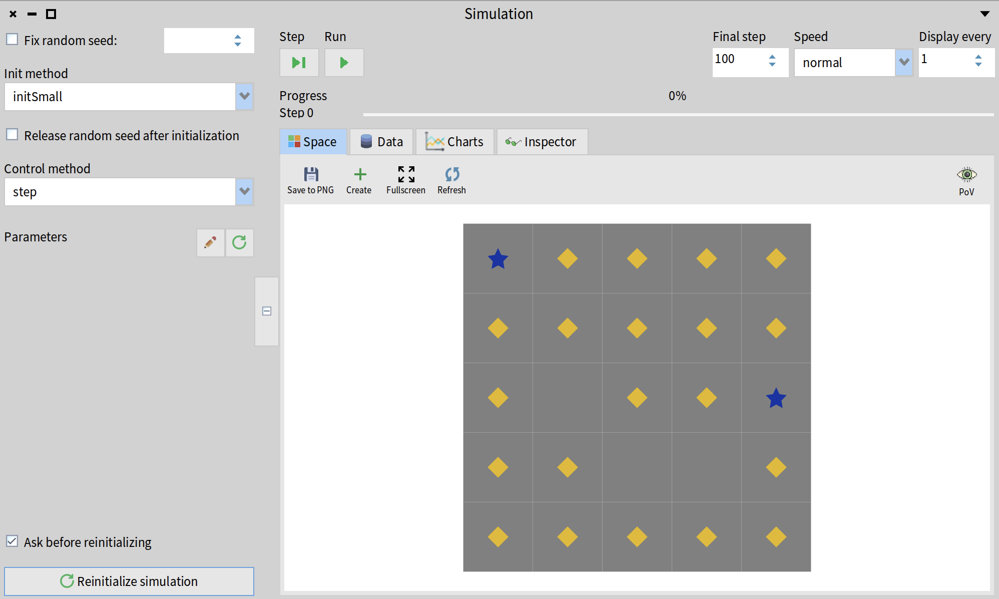

We will also add two helper methods to `RFCell` class that will be useful in the next sections. First, we add a method `hasMineral` which answers `true` if the cell has occupants of class `RFMineral`.

```smalltalk
RFCell >> hasMineral
	^ self hasOccupantsOfClass: RFMineral
```

We also define a method `getMineral` that will return a mineral from the cell. The first line of this method checks if the cell has a mineral on it. If not, it signals an error.

```smalltalk
RFCell >> getMineral
	self hasMineral ifFalse: [ self error: 'This cell has no minerals' ].
	^ (self occupantsOfClass: RFMineral) first
```

## Step 8. Make robots collect the minerals

We start by adding an instance variable `collectedMinerals` to `RFRobot` and adding a new `initialize` method to this class where we assign an empty `OrderedCollection` to `collectedMinerals` variable. We will use this collection to store the minerals that the robot has collected.

```smalltalk
CMAgent << #RFRobot
	traits: {TCMLocated};
	slots: { #collectedMinerals };
	package: 'RobotForager-Model'
```
```smalltalk
RFRobot >> initialize
	super initialize.
	collectedMinerals := OrderedCollection new
```

We provide an accessor for this collection because we will need to access it later to measure the number of collected minerals. Pay attention that in this case, we do not add the`<getterFor:>` pragma. It is only used by the model class to identify collections that should be managed by Cormas and store model entities such as agents or cells.

```smalltalk
RFRobot >> collectedMinerals
	^ collectedMinerals
```

Now we must define two more actions for our robots: `move` and `collectMineral`.

The `move` action should make the robot look at the neighbouring cells, find one that contains a mineral and move there. If there are no minerals around, robot should move randomly. We access the neighbouring calls by first getting the cell at which a robot is currently located (this cell can be accessed using the `patch` method, patch is just an old name for cell in Cormas) and then calling the `neighbourhood` method of that cell.

```smalltalk
RFRobot >> move
	<action>
	self patch neighbourhood
		detect: [ :cell | cell hasMineral ]
		ifFound: [ :cell | self moveTo: cell ]
		ifNone: [ self moveRandomly ]
```
The `collectMineral` action should make the robot collect minerals from the cell at which it is currently located. If there are no minerals, the robot should do nothing (`^ self` is a common way to stop the execution of a method). To collect the mineral, we add it to the `collectedMinerals` collection and remove it from the grid using the `leave` method. This method makes the agent leave from its current cell but keeps this agent in the simulation.

```smalltalk
RFRobot >> collectMineral
	<action>
	| mineral |
	self patch hasMineral ifFalse: [ ^ self ]. 
	mineral := self patch getMineral.
	collectedMinerals add: mineral.
	mineral leave
```
Finally, we define the `step` action for our robots that will first perform the `move` action and then the `collectMineral` action.

```smalltalk
RFRobot >> step
	<action>
	self move.
	self collectMineral
```
Update the `step` method of `RFModel` to call the `step` method of robots and not the `moveRandomly` method.

```smalltalk
RFModel >> step
    <control>
    robots do: [ :each | each step ]
```

Now you can re-initialize your simulation (to make sure that the robots are re-created and their `collectedMineral` collections are initialized) and click on the _"Run"_ button. Your robots should start collecting minerals now.

If you right-click on any robot and then click on _"Inspect"_, you should be able to explore the `collectedMinerals` collection of that robot and see that it contains all the minerals that the robet has collected. 

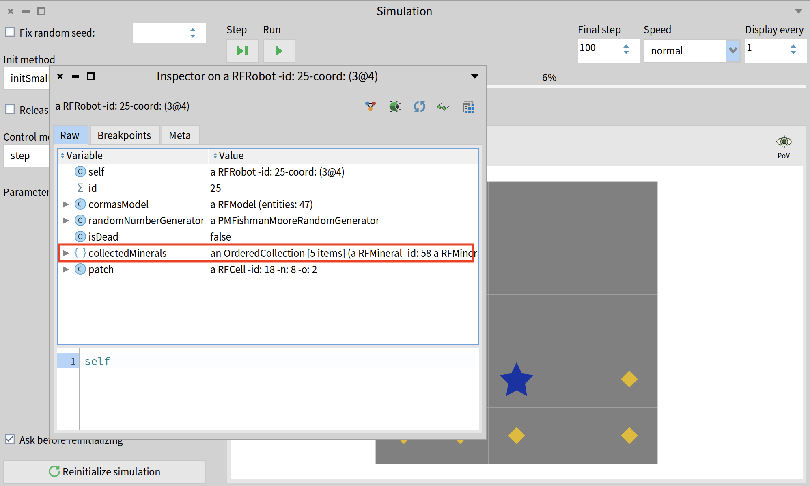

## Step 9. Add some probes

Probes are the methods that perform numerical measurements at every step of the simulation. They define the columns of a dataset that will be recorded. In this tutorial, we will add two probes to our model: one to measure the **number of collected minerals** and another one to measure the **number of remaining minerals**.

We start by adding a method `numberOfCollectedMinerals` to `RFModel` and adding a pragma `<probeNamed: color:>` to it. This pragma accepts two arguments: the probe name that will be displayed in the dataset and the hex code of a color that will be used for charting.

```smalltalk
RFModel >> numberOfCollectedMinerals
	<probeNamed: 'Collected minerals' color: '00B44C'>
	^ robots sum: [ :each | each collectedMinerals size ]
```

The hex code in teh method above corresponds to `CMColor green`. You can get a hex code of any color in Pharo by sending a message `asHexString` to it. For example:

```smalltalk
CMColor green asHexString. "00B44C"
```

To implement the second probe, we count the number of minerals that are still located on the grid - the ones that have a `patch` (cell) which is not `nil`.

```smalltalk
RFModel >> numberOfRemainingMinerals
	<probeNamed: 'Remaining minerals' color: 'E5B80B'>
	^ minerals count: [ :each | each patch isNotNil ]
```
You can now run the simulation and click on the _"Data"_ tab to see the dataset that is being collected.


You can also click on the _"Charts"_ tab to get this data visualized.

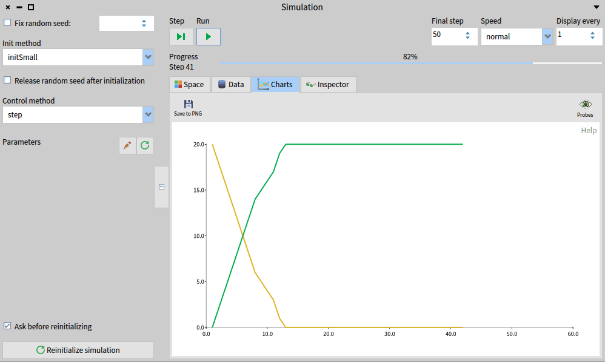

By clicking on the _"Probes"_ button (with the eye icon) in the top right corner of the _"Charts"_ page, you can select or unselect the probes that are being visualized.

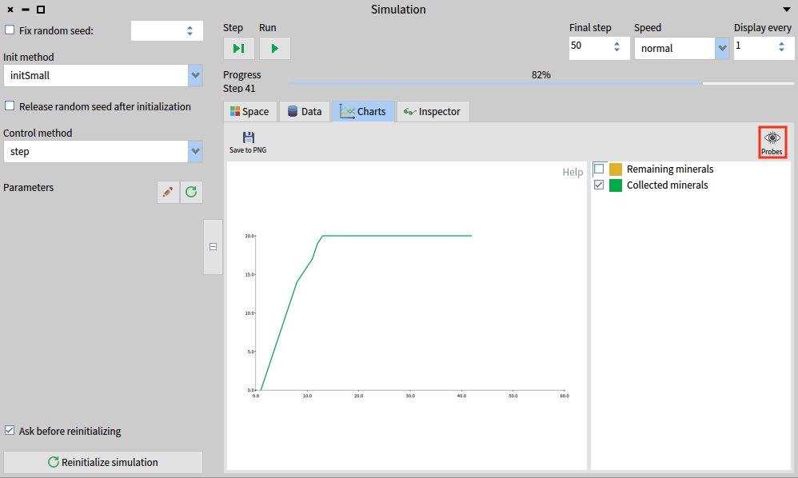

## Step 10. Define a larger environment

We have implemented a simple 5x5 grid with 2 robots and 20 minerals. Let us now implement a second init method that defines a large environment with 27x27 cells, 10 robots, and 200 minerals. To do that, we simply add another method with `<init>` pragma to the `RFModel`.

```smalltalk
RFModel >> initLarge
	<init>
	self
        createGridNumberOfRows: 27
        numberOfColumns: 27
        neighbourhood: 8
        closed: true.

	self createN: 10 randomlyLocatedAloneEntities: RFRobot.
	self createN: 200 randomlyLocatedAloneEntities: RFMineral
```

Now you can open your simulation again and select `initLarge` from the dropdown list of init methods on the left. Initialize the simulation and run the simulation to see the results.

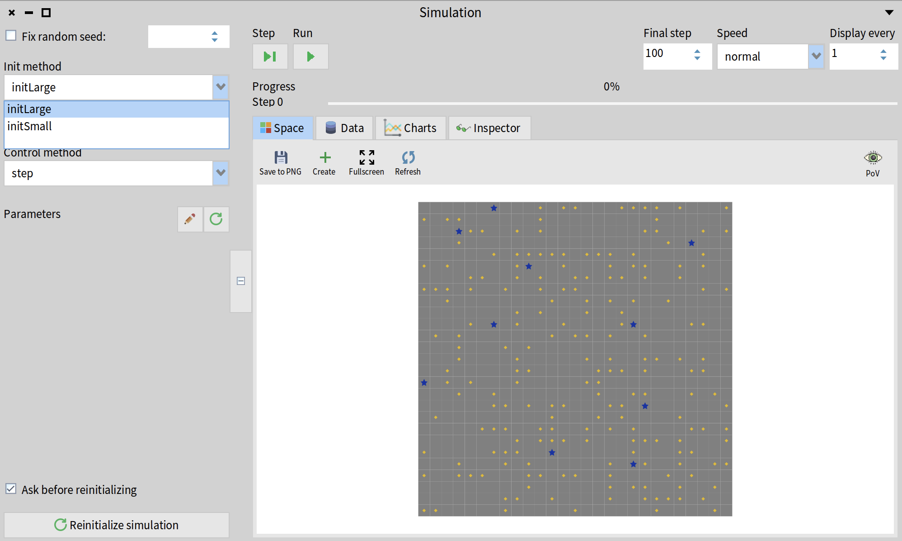

## Step 11. Define model parameters

You should have noticed that `initSmall` and `initLarge` have the same implementation but different numerical values (fun fact: such numbers inserted directly into the source code are called [magic numbers](https://en.wikipedia.org/wiki/Magic_number_(programming)), they are usually considered a bad practice).

We will replace them with model parameters - named constant values that can be accessed and dynamically modified during the simulation. To do that, we must first create 4 class side variables for our model: `numberOfRows`, `numberOfColumns`, `numberOfRobots`, and `numberOfMinerals`. Go to the class side by clicking on the _"Class side"_ button in your System Browser. Then add the array of slots to the class definition:

```smalltalk
CMAbstractModel class << RFModel class
	slots: { #numberOfRows . #numberOfColumns . #numberOfRobots . #numberOfMinerals }
```

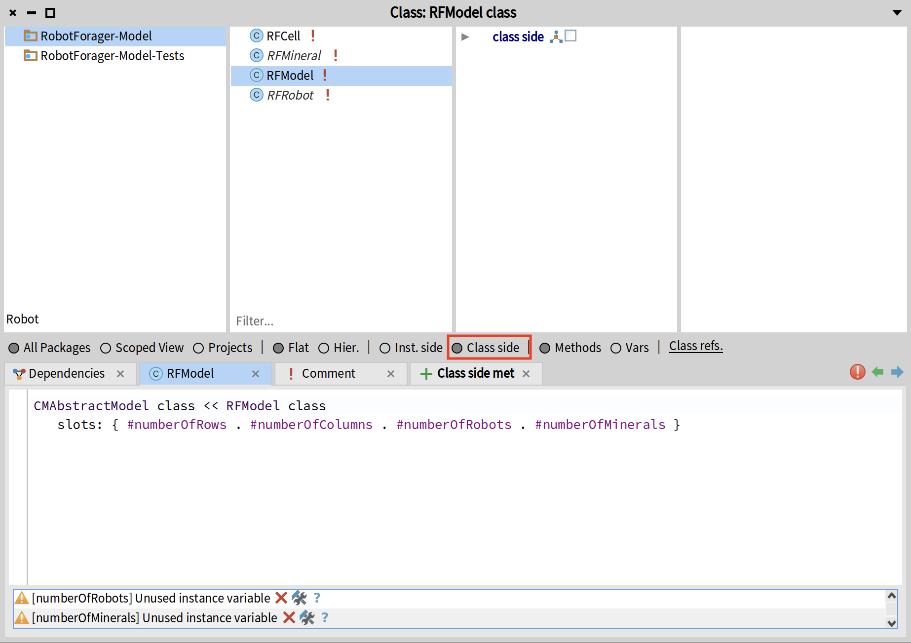

Now, while still on the class side, create a new method called `initializeParameters`. This is a special method that will be called by Cormas when the model is initialized. The first line of this method must always be `super initializeParameters`, to make sure that the superclass parameters are also initialized (same principle as for the `initialize` method of the instance side). In the following lines, provide the default values for each parameter.

```smalltalk
RFModel class >> initializeParameters
	super initializeParameters.
	numberOfRows := 5.
	numberOfColumns := 5.
	numberOfRobots := 2.
	numberOfMinerals := 20
```

Make sure that you create this method on the class side and not the instance side (this is a common mistake!). If you do this correctly, you should see a little arrow near the method name indicating that the method is overriding the superclass implementation. You can click on this arrow to see the method of the superclass.

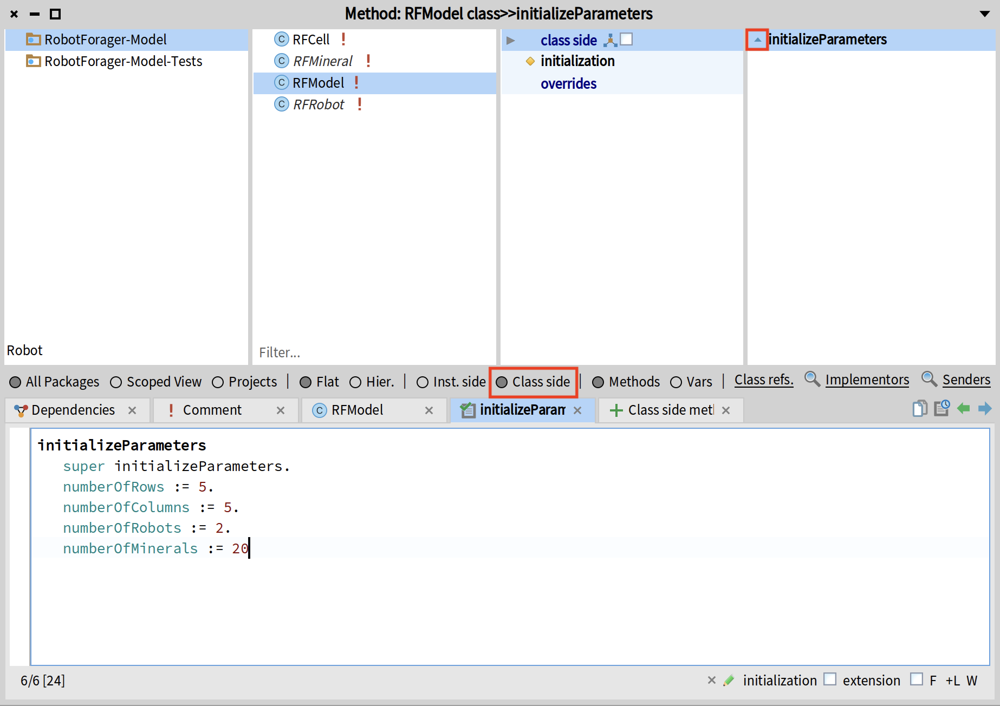

Now we need to create getter and setter accessors for each parameter. You can do this automatically by right-clicking on the class, selecting _"Generate accessors"_ from the menu and applying all the proposed refactoring changes. Once this is done, you should see 8 new methods: `numberOfRows`, `numberOfRows:`, `numberOfColumns`, etc.

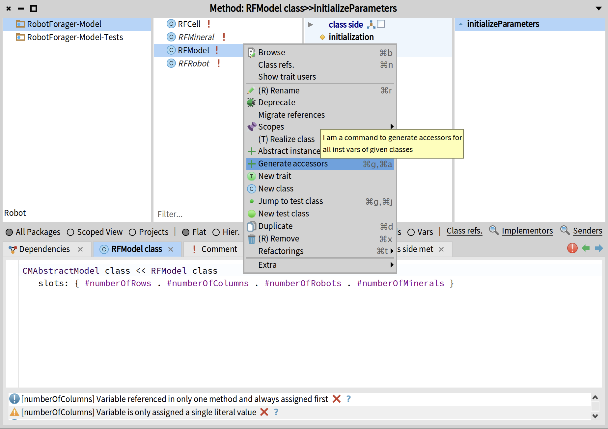

Now we create a parametrized init method that will use the parameters instead of numbers. To access the paramenters, we simply call the corresponding class side getter accessors. For example, we use `self class numberOfRows` instead of directly writing numbers `5` or `27`.

```smalltalk
RFModel >> init
    <init>
    self
        createGridNumberOfRows: self class numberOfRows
        numberOfColumns: self class numberOfColumns
        neighbourhood: 8
        closed: true.

	self createN: self class numberOfRobots randomlyLocatedAloneEntities: RFRobot.
	self createN: self class numberOfMinerals randomlyLocatedAloneEntities: RFMineral
```

Now you can select the new `init` method from the list, and modify the parameters before initializing your model. To modify the parameter, click on the little pencil icon (1) on the left side of the Simulation window. This will open a _"Parameter Editor"_ allowing you to select the class which defines your parameter (2) and modify its value (3). Those numbers are editable text fields, so you can simply type the new values and they will be saved.

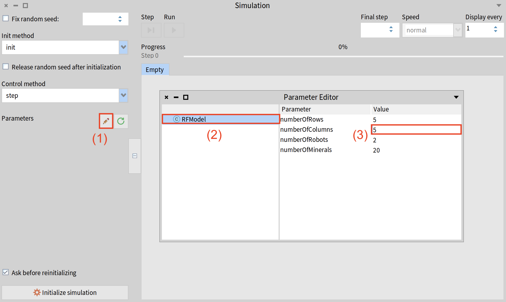

Try it yourself by setting the number of rows to 7, number of columns to 30, number of robots to 5 and number of minerals to 100. Once you have entered the values, you can close the editor, initialize the simulation and run it.

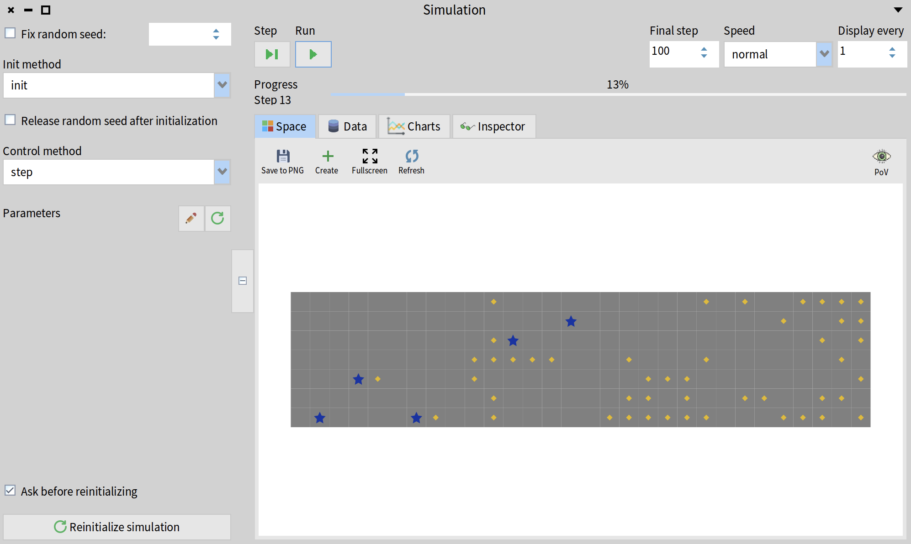

## Conclusion

This simple tutorial demonstrated the basic functionality of Cormas, teaching you how to create a simple model and run a simulation. Real-life models are often more complex but the underlying principles remain the same. 
